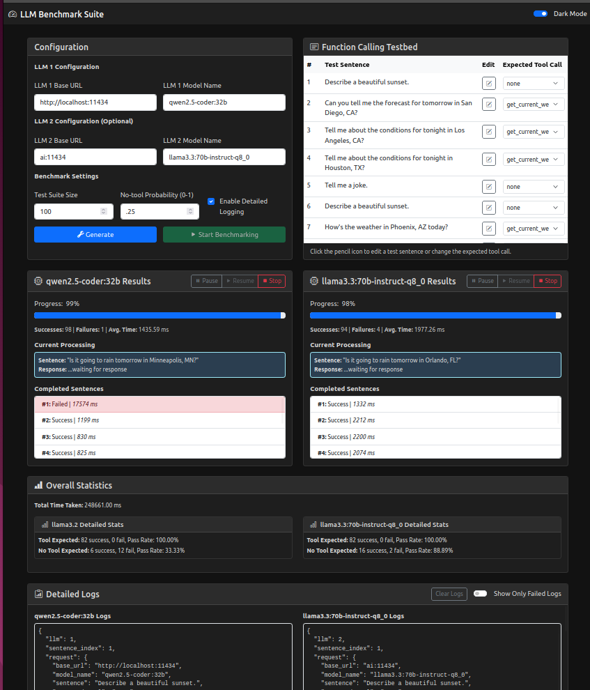

# LLM Benchmark Suite

The **LLM Benchmark Suite** is a versatile application designed to test and compare the performance and functionality of Large Language Models (LLMs) using various test scenarios. The suite supports evaluating tool-calling capabilities, analyzing response times, and benchmarking multiple LLMs simultaneously.

---

## Features

### 1. **Multi-Model Benchmarking**
   - Compare multiple models side-by-side (e.g., Qwen, LLaMA, etc., that support tool calls).
   - Supports customizable test suites with varied input sentences and tool expectations.

### 2. **Tool-Calling Functionality**
   - Models are tested on their ability to call external tools such as:
     - `get_current_weather`: Fetches weather information.
     - `get_system_time`: Provides the current system time.

### 3. **Detailed Results and Logs**
   - Progress tracking for each model.
   - Success/Failure rates and average response times displayed.
   - Exportable logs showing detailed tool-call and response data.

### 4. **Configurable Test Settings**
   - Custom test sentences with optional expected tool calls.
   - Adjustable no-tool probability for generating edge cases.
   - Enable/Disable detailed logging for streamlined benchmarking.

---

## How It Works

1. **Configuration:**
   - Input the base URL and model name for each LLM.
   - Optionally, configure a second model for comparison.

2. **Test Suite Setup:**
   - Define test sentences.
   - Specify whether a tool call is expected (`none` or a specific tool).

3. **Start Benchmarking:**
   - Run the test suite and monitor progress for each model in real time.

4. **Analyze Results:**
   - View summary statistics:
     - Total Successes/Failures.
     - Average response time.
   - Access detailed logs for each test case.

---

## Screenshots

### Configuration and Test Results


---

## Installation

### Prerequisites:
- Python 3.8+
- [FastAPI](https://fastapi.tiangolo.com/)
- [Uvicorn](https://www.uvicorn.org/)
- **Optional**: Docker and Docker Compose for containerized deployment.

---

## Starting the Application

### **Option 1: Without Docker (Direct Python)**

1. Clone the repository:
   ```bash
   git clone https://github.com/Teachings/llm_tools_benchmark.git
   cd llm_tools_benchmark
   ```

2. Install dependencies:
   ```bash
   pip install -r requirements.txt
   ```

3. Start the application:
   ```bash
   uvicorn main:app --reload --port 8090
   ```

4. Access the UI at:
   ```
   http://localhost:8090
   ```

---

### **Option 2: With Docker**

1. Clone the repository:
   ```bash
   git clone https://github.com/Teachings/llm_tools_benchmark.git
   cd llm_tools_benchmark
   ```

2. Build the Docker image:
   ```bash
   docker build -t llm-benchmark-suite .
   ```

3. Start the container:

Run the container with `--network=host` for local testing:

   ```bash
   docker run --network=host -p 8090:8090 llm-benchmark-suite
   ```
Run the container without `--network=host` for prod deployment:

   ```bash
   docker run -p 8090:8090 llm-benchmark-suite
   ```

4. Access the UI at (for local):
   ```
   http://localhost:8090
   ```
## Configuration Options

### `LLM 1 Configuration`
- **Base URL**: Endpoint of the LLM server.
- **Model Name**: Name of the LLM model.

### `LLM 2 Configuration`
- Optional secondary model for comparative benchmarking.

### `Benchmark Settings`
- **Test Suite Size**: Number of test sentences to generate.
- **No-tool Probability**: Probability that no tool call is expected.
- **Enable Detailed Logging**: Toggle for saving extended logs.

---

## API Endpoints

### `POST /benchmark`
- Accepts a JSON payload to benchmark a model:
  ```json
  {
    "base_url": "http://localhost:11434",
    "model_name": "qwen2.5-coder-32b",
    "sentence": "Tell me a joke.",
    "expected_tool": "none"
  }
  ```
- Returns:
  - Success status
  - Tool-call details
  - Model response
  - Processing time

---

## Troubleshooting

### Issue: Docker container cannot connect to `localhost:11434`.
- Use `host.docker.internal` instead of `localhost`.
- Run the container with `--network=host` for local testing:
  ```bash
  docker run --network=host -p 8090:8090 llm-benchmark-suite
  ```
